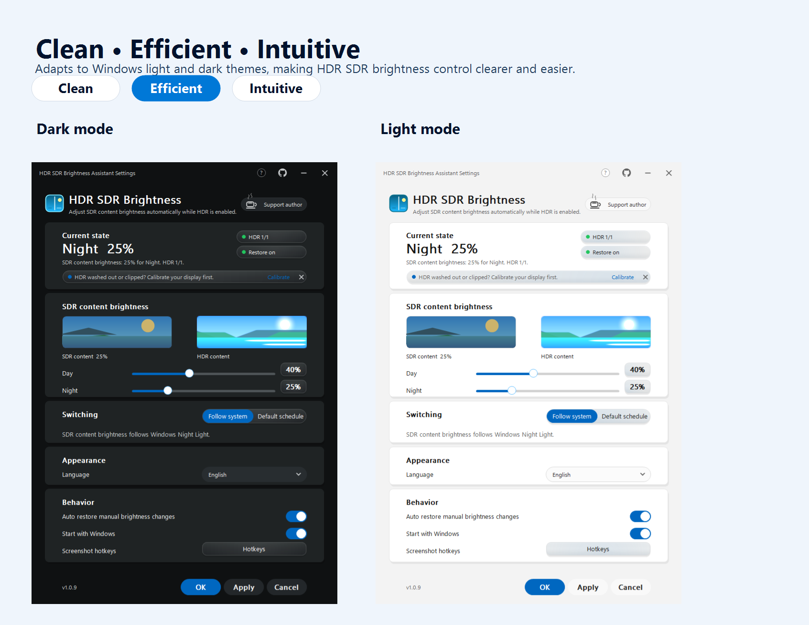
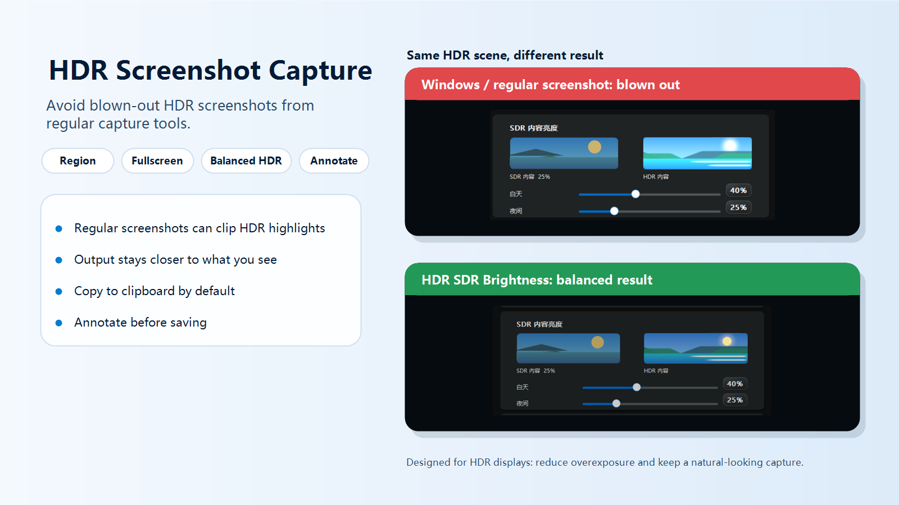
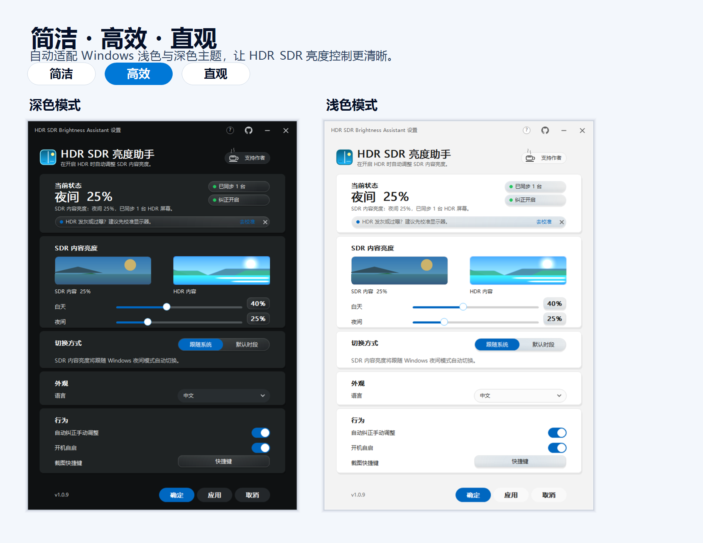
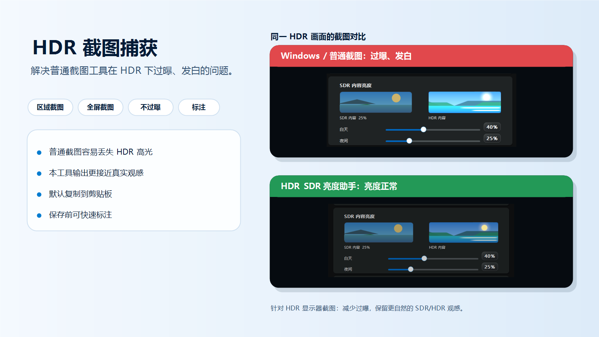

# HDR SDR Brightness

[English](#english) | [中文](#中文)

## English

**HDR SDR Brightness** is a lightweight Windows tray app for keeping **SDR content brightness** predictable when Windows HDR is enabled.

It is built for OLED, QD-OLED, MiniLED, HDR monitors, HDR TVs, and HDR laptop panels where regular SDR apps may look too bright, too dim, or washed out after HDR is turned on.



<p>
  <a href="https://apps.microsoft.com/detail/9nksvcpjl35j">
    
  </a>
</p>

### Download

Install from the [Microsoft Store](https://apps.microsoft.com/detail/9nksvcpjl35j), or download the portable package from [GitHub Releases](https://github.com/yinjunonly/hdr-sdr-brightness/releases/latest).

Use the Windows x64 package:

```text
HdrSdrBrightness-1.0.16-win64.zip
```

Extract the archive and run `HdrSdrBrightness.exe`. The app is portable: no installer, no service, and no administrator privileges are required.

### What's New In 1.0.16

- Fixes a region HDR screenshot preview/output overexposure regression introduced in 1.0.15.
- Keeps the fast region selection overlay, then refreshes it with the stable HDR tone-mapped preview when the capture is ready.
- Restores the safer full-frame HDR tone mapping path before cropping the selected region.
- Keeps the warmed persistent HDR capture helper for faster repeated screenshot startup.



### Common Use Cases

- Windows HDR makes SDR desktop apps look too bright, too dim, or washed out.
- You use an OLED, QD-OLED, MiniLED, HDR monitor, HDR TV, or HDR laptop panel and want separate day/night SDR brightness.
- You want lightweight Windows HDR SDR brightness control without drivers, services, or a heavy background process.

### What It Does

- Applies your preferred Windows SDR content brightness while HDR is active.
- Supports separate **Day** and **Night** SDR brightness levels.
- Can follow **Windows Night Light**, or use a built-in fallback schedule.
- Restores the configured SDR brightness if a manual change is detected.
- Provides a live SDR/HDR preview in the settings window.
- Captures HDR screenshots that are less prone to the overexposed or washed-out look produced by many regular screenshot tools, with region selection, fullscreen capture, clipboard copy, save, and simple annotations.
- Links to Microsoft's Windows HDR Calibration app for display-level HDR calibration.
- Runs quietly from the system tray and can start with Windows.
- Follows the Windows light/dark app theme automatically.
- Supports Auto, Simplified Chinese, Traditional Chinese, English, Korean, Japanese, Russian, and German.

### Design And Interaction

HDR SDR Brightness is designed to feel simple in daily use: open it, choose comfortable day and night SDR brightness, then let it stay out of the way in the tray.

The interface follows the Windows light or dark app theme automatically. Cards group related settings, sliders make brightness easy to compare, switches show on/off state clearly, and the SDR/HDR preview gives immediate visual feedback before you apply changes.

Small interactions are kept responsive and restrained: buttons and controls react to the pointer with soft reveal highlights, dropdowns and brightness changes transition smoothly, and the Microsoft Store download badge has a subtle motion cue without distracting from the main settings.

### Recommended Defaults

| Setting | Default |
| --- | --- |
| Day SDR content brightness | `40%` |
| Night SDR content brightness | `25%` |
| Switching mode | Follow Windows Night Light when available |
| Fallback schedule | Night starts at `18:00`, day starts at `08:00` |
| Restore manual changes | On |
| Region screenshot hotkey | `Alt+S` |
| Fullscreen screenshot hotkey | `Shift+Alt+S` |

These values are only starting points. Tune them for your panel, room lighting, and preferred SDR white level.

Early community feedback and reported SDR brightness ranges are collected in [docs/feedback.md](docs/feedback.md).

### When SDR Brightness Is Not Enough

This app adjusts the Windows **SDR content brightness** level while HDR is enabled. If your HDR display is still washed out, clips highlights, has incorrect peak brightness, or looks wrong even after changing SDR brightness, also run Microsoft's official **Windows HDR Calibration** app:

```text
https://apps.microsoft.com/detail/9n7f2sm5d1lr?hl=en-US&gl=US
```

Microsoft's calibration app is useful for display-level HDR calibration, while HDR SDR Brightness is focused on day/night SDR content brightness control. They are complementary tools.

When an HDR display is detected, HDR SDR Brightness also provides quick access to Windows HDR Calibration from the tray menu and from the settings window.

### Tray Usage

Run `HdrSdrBrightness.exe` to open Settings and keep the app in the tray.

Run `HdrSdrBrightness.exe --background` for tray-only startup. This is the mode used by Start with Windows.

The tray menu includes Apply now, Capture HDR screenshot, Settings, Start with Windows, Display settings, Night Light settings, Windows HDR Calibration, Download from Microsoft Store, and Exit.

### Download From Microsoft Store

The GitHub release ZIP is free. If this app improves your HDR setup, downloading from Microsoft Store supports continued development and includes automatic updates:

```text
https://apps.microsoft.com/detail/9nksvcpjl35j?cid=github-readme
```

Both builds provide the same core features.

### Background Performance


Measured with the settings window closed and the app running in `--background` tray mode, before invoking screenshot capture:

| Metric | Result |
| --- | ---: |
| Sample duration | 60 seconds |
| Average CPU | 0.0000% |
| Peak CPU | 0.0000% |
| Average working set | 13.8 MB |
| Peak working set | 13.8 MB |
| Average private memory | 3.0 MB |
| Peak private memory | 3.0 MB |
| Average handles | 195 |
| Average threads | 5 |

Sampling method: 1 second process samples after a 5 second warm-up. CPU is calculated from `TotalProcessorTime` deltas and normalized across 12 logical processors. Actual values can vary by display count, HDR state, Windows build, GPU driver, and hardware.

HDR screenshot capture is optimized for quick daily use. The tray app warms `HdrSdrCapture.exe` shortly after startup and keeps it alive with the tray process, so region capture can avoid repeated .NET/WinForms cold starts. The helper waits quietly on a named pipe while idle and does not keep a Windows Graphics Capture session running until a screenshot is requested. Memory is higher than the tray app alone while the helper is resident, but idle CPU/GPU usage should stay near zero.

The background path is designed to stay quiet:

- Settings UI resources are loaded only while Settings is open.
- Animation timers are started on demand and stopped when idle.
- Startup state is not queried in the 15 second brightness correction path.
- Windows Night Light state is cached and refreshed through registry notifications.

### Privacy And Startup

Configuration is stored for the current Windows user:

```text
HKCU\Software\OledHdrSdrSync
```

In the portable desktop build, Start with Windows uses the current-user Run key:

```text
HKCU\Software\Microsoft\Windows\CurrentVersion\Run\HdrSdrBrightness
```

The Microsoft Store build uses the packaged Windows startup task and reflects the current state from Windows Settings > Apps > Startup.

The app does not create a service and does not require administrator privileges. When Windows denies scheduled task creation in the portable build, the current-user Run entry remains the startup path.

The portable build does not require accounts, services, or online activation.

### Source Code

The source code is available in this repository for transparency and community review. Most people should install from the Microsoft Store or use the release ZIP rather than building the app themselves.

### License

MIT License. See [LICENSE](LICENSE).

### Search Keywords

```text
Windows HDR SDR brightness
Windows HDR SDR content brightness
Windows SDR content brightness
HDR SDR brightness balance
HDR/SDR brightness balance
SDR content brightness slider
SDR content brightness too bright
SDR content too dark in HDR
Windows HDR washed out
Windows 11 HDR washed out
Auto HDR washed out
HDR screenshot overexposed
HDR screenshot blown out
HDR screenshot too bright
Windows HDR screenshot overexposure
Windows screenshot HDR overexposed
HDR capture washed out
OLED HDR brightness
QD-OLED HDR brightness
MiniLED HDR brightness
HDR monitor SDR brightness
HDR TV Windows SDR brightness
Windows Night Light SDR brightness
SDR white level
```

## 中文

**HDR SDR 亮度助手** 是一个轻量的 Windows 托盘工具，用来在开启 Windows HDR 时，让 **SDR 内容亮度** 保持稳定、舒适、可预期。

它适合 OLED、QD-OLED、MiniLED、HDR 显示器、HDR 电视和支持 HDR 的笔记本屏幕。开启 HDR 后，如果普通 SDR 软件看起来过亮、过暗或发灰，可以用它自动切换和修正 SDR 内容亮度。



<p>
  <a href="https://apps.microsoft.com/detail/9nksvcpjl35j">
    
  </a>
</p>

### 下载

可以从 [Microsoft Store](https://apps.microsoft.com/detail/9nksvcpjl35j) 安装，也可以从 [GitHub Releases](https://github.com/yinjunonly/hdr-sdr-brightness/releases/latest) 下载便携版。

Windows x64 用户下载：

```text
HdrSdrBrightness-1.0.16-win64.zip
```

解压后运行 `HdrSdrBrightness.exe`。这是便携程序：不需要安装，不创建服务，也不需要管理员权限。

### 1.0.16 更新内容

- 修复 1.0.15 引入的区域 HDR 截图预览/成图过曝回归。
- 保留快速弹出的区域框选层，并在 HDR 捕获完成后自动刷新为稳定的 HDR tone-mapped 预览。
- 恢复更稳妥的整屏 HDR tone mapping 后再裁剪选区的成图路径。
- 保留常驻 HDR 截图 helper 的预热机制，减少重复截图时的启动等待。



### 常见使用场景

- 开启 Windows HDR 后，SDR 桌面应用看起来过亮、过暗或发灰。
- 你正在使用 OLED、QD-OLED、MiniLED、HDR 显示器、HDR 电视或 HDR 笔记本屏幕，并希望分别设置白天/夜间 SDR 亮度。
- 你需要一个轻量的 Windows HDR SDR 亮度调节工具，不安装驱动、不创建服务，也不常驻重型后台进程。

### 它能做什么

- HDR 开启时自动应用你设定的 Windows SDR 内容亮度。
- 支持单独设置 **白天** 和 **夜间** SDR 内容亮度。
- 可以跟随 **Windows 夜间模式**，也可以使用内置默认时段。
- 检测到手动修改 SDR 内容亮度后，可以自动恢复到配置值。
- 设置页提供 SDR/HDR 实时预览。
- 支持 HDR 截图：相比很多普通截图工具，更不容易把 HDR 画面截得过曝或发白，并提供区域选择、全屏捕获、剪贴板复制、保存和简单标注。
- 提供微软 Windows HDR Calibration 入口，用于显示器级 HDR 校准。
- 常驻系统托盘，并支持开机后安静启动。
- 自动跟随 Windows 应用浅色/深色主题。
- 支持自动、简体中文、繁体中文、English、한국어、日本語、Русский、Deutsch。

### 设计与交互

HDR SDR 亮度助手的设计目标是日常使用足够简单：打开后设置好白天和夜间 SDR 亮度，之后让它安静留在托盘里自动工作。

界面会自动跟随 Windows 浅色或深色应用主题。卡片负责整理设置分区，滑块方便直观看到亮度差异，开关清楚表达开启/关闭状态，SDR/HDR 预览则让你在应用设置前先看到变化。

交互效果尽量克制但有反馈：按钮和控件会跟随鼠标出现柔和高光，下拉菜单和亮度预览有平滑过渡，Microsoft Store 下载徽章有轻微动态提示，但不会干扰主要设置。

### 推荐默认值

| 设置 | 默认值 |
| --- | --- |
| 白天 SDR 内容亮度 | `40%` |
| 夜间 SDR 内容亮度 | `25%` |
| 切换方式 | 优先跟随 Windows 夜间模式 |
| 默认时段 | `18:00` 进入夜间，`08:00` 进入白天 |
| 自动纠正手动调整 | 开启 |
| 区域截图快捷键 | `Alt+S` |
| 全屏截图快捷键 | `Shift+Alt+S` |

这些只是起点。你可以根据屏幕类型、房间光线和自己习惯的 SDR 白点继续调整。

早期社区反馈和用户提到的 SDR 亮度范围整理在 [docs/feedback.md](docs/feedback.md)。

### SDR 亮度仍然不够时

本工具调整的是 HDR 开启时 Windows 的 **SDR 内容亮度**。如果调整 SDR 亮度后，屏幕仍然发灰、高光过曝、峰值亮度不准，或 HDR 整体观感仍然异常，建议同时使用微软官方 **Windows HDR Calibration** 应用进行 HDR 校准：

```text
https://apps.microsoft.com/detail/9n7f2sm5d1lr?hl=zh-CN&gl=US
```

微软的校准应用更适合处理显示器级别的 HDR 校色和峰值亮度配置；HDR SDR 亮度助手则负责日夜模式下的 SDR 内容亮度控制。两者是配套关系。

检测到 HDR 显示器后，HDR SDR 亮度助手也会在托盘菜单和设置窗口中提供 Windows HDR Calibration 快捷入口。

### 托盘使用

运行 `HdrSdrBrightness.exe` 会打开设置页，同时程序留在系统托盘。

运行 `HdrSdrBrightness.exe --background` 会只进入托盘；开机自启使用这个模式。

托盘菜单包含：立即应用、截取 HDR 截图、设置、开机自启、打开显示设置、打开夜间模式设置、Windows HDR Calibration、从 Microsoft Store 下载、退出。

### 从 Microsoft Store 下载

GitHub Release ZIP 是免费的。如果这个工具帮到了你，从 Microsoft Store 下载可以支持后续开发，并获得自动更新：

```text
https://apps.microsoft.com/detail/9nksvcpjl35j?cid=github-readme
```

两个版本提供相同的核心功能。

### 后台性能


以下数据来自设置窗口关闭、程序以 `--background` 托盘模式运行，且尚未调用截图功能时的采样：

| 指标 | 结果 |
| --- | ---: |
| 采样时长 | 60 秒 |
| 平均 CPU | 0.0000% |
| 峰值 CPU | 0.0000% |
| 平均工作集内存 | 13.8 MB |
| 峰值工作集内存 | 13.8 MB |
| 平均私有内存 | 3.0 MB |
| 峰值私有内存 | 3.0 MB |
| 平均句柄数 | 195 |
| 平均线程数 | 5 |

采样方式：预热 5 秒后，每 1 秒读取一次进程数据。CPU 使用进程 `TotalProcessorTime` 增量计算，并按 12 个逻辑处理器归一化。实际占用会随显示器数量、HDR 状态、Windows 版本、显卡驱动和硬件环境变化。

HDR 截图针对日常快速使用做了优化。托盘主程序启动后会提前预热 `HdrSdrCapture.exe`，并让它跟随托盘进程保持运行，避免区域截图反复支付 .NET/WinForms 冷启动成本。helper 空闲时只等待命名管道命令，不会持续保持 Windows Graphics Capture 会话；相比单独的托盘进程，内存占用会更高，但空闲 CPU/GPU 占用应接近 0。

后台路径尽量保持安静：

- 设置页绘制资源只在设置窗口打开时加载。
- 动画计时器按需启动，空闲后停止。
- 开机自启状态不会放进每 15 秒亮度检查路径。
- Windows 夜间模式状态会缓存，并由注册表通知刷新。

### 隐私与自启动

配置保存在当前 Windows 用户注册表：

```text
HKCU\Software\OledHdrSdrSync
```

便携桌面版开机自启使用当前用户 Run 项：

```text
HKCU\Software\Microsoft\Windows\CurrentVersion\Run\HdrSdrBrightness
```

Microsoft Store 版使用 Windows 打包启动任务，并会从 Windows 设置 > 应用 > 启动 同步当前状态。

程序不创建服务，也不需要管理员权限。如果便携版遇到 Windows 拒绝创建计划任务，会继续使用当前用户 Run 项作为启动方式。

便携版不需要账号、服务或在线激活。

### 源代码

本仓库公开源代码，方便查看和审阅。大多数用户建议直接从 Microsoft Store 安装，或下载 Release ZIP 包，不需要自己构建。

### 开源许可

MIT License，详见 [LICENSE](LICENSE)。

### 搜索关键词

```text
Windows HDR 自动亮度
Windows HDR SDR 亮度
Windows SDR 内容亮度
Windows SDR 内容亮度滑块
HDR 下 SDR 内容过亮
HDR 下 SDR 内容过暗
HDR 开启后颜色发灰
HDR 发灰
HDR 洗白
Auto HDR 发灰
HDR 截图过曝
HDR 截图发白
HDR 截图太亮
HDR 截图高光丢失
Windows HDR 截图过曝
Windows 截图 HDR 过曝
OLED HDR 太亮
OLED HDR 太暗
QD-OLED HDR 亮度
MiniLED HDR 亮度
HDR 显示器 SDR 亮度
HDR 电视 Windows SDR 亮度
Windows 夜间模式 SDR 亮度
SDR White Level
```
