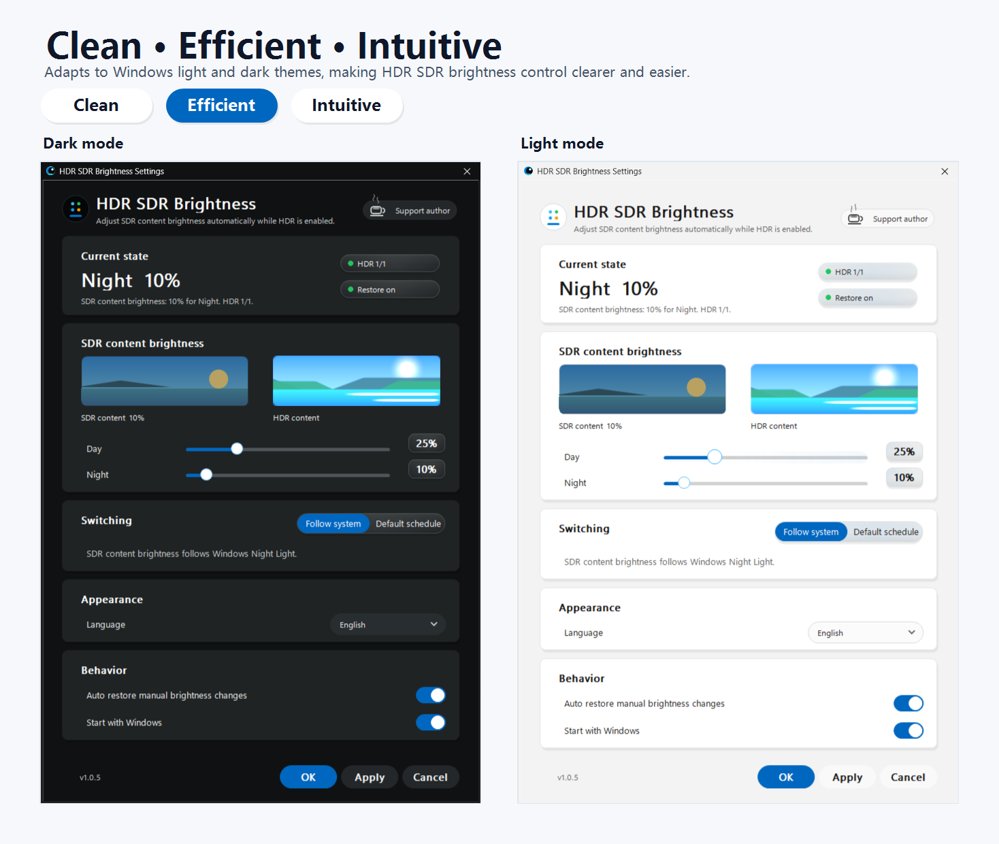
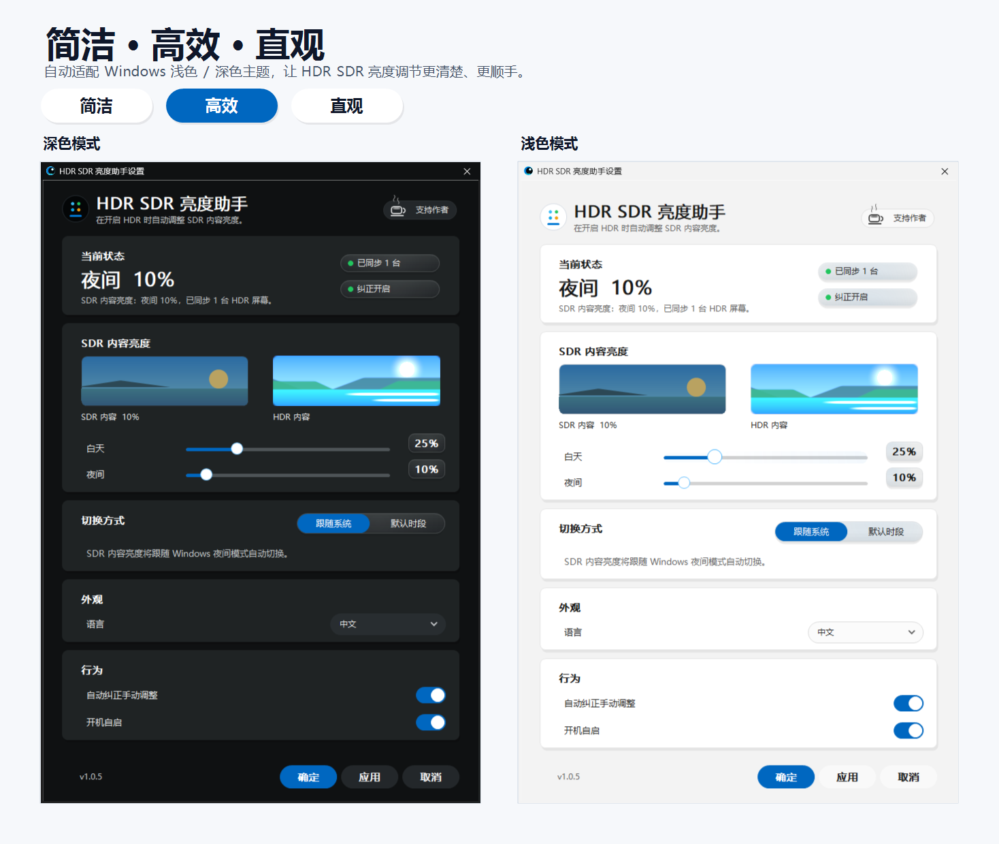

# HDR SDR Brightness

[English](#english) | [中文](#中文)

## English

**HDR SDR Brightness** is a lightweight Windows tray app for keeping **SDR content brightness** predictable when Windows HDR is enabled.

It is built for OLED, QD-OLED, MiniLED, HDR monitors, HDR TVs, and HDR laptop panels where regular SDR apps may look too bright, too dim, or washed out after HDR is turned on.



### Download

Download the latest release from [GitHub Releases](https://github.com/yinjunonly/hdr-sdr-brightness/releases/latest).

Use the Windows x64 package:

```text
HdrSdrBrightness-1.0.7-win64.zip
```

Extract the archive and run `HdrSdrBrightness.exe`. The app is portable: no installer, no service, and no administrator privileges are required.

### What's New In 1.0.7

- Adds Windows HDR Calibration shortcuts from the tray menu and settings window when an HDR display is active.
- Shows a one-time HDR calibration reminder to help distinguish SDR brightness tuning from display-level HDR calibration.
- Improves Microsoft Store startup handling by syncing the packaged startup task state back into Settings.
- Declares localized Store package resources for Simplified Chinese, Traditional Chinese, Korean, Japanese, Russian, and German.

### What It Does

- Applies your preferred Windows SDR content brightness while HDR is active.
- Supports separate **Day** and **Night** SDR brightness levels.
- Can follow **Windows Night Light**, or use a built-in fallback schedule.
- Restores the configured SDR brightness if a manual change is detected.
- Provides a live SDR/HDR preview in the settings window.
- Links to Microsoft's Windows HDR Calibration app for display-level HDR calibration.
- Runs quietly from the system tray and can start with Windows.
- Follows the Windows light/dark app theme automatically.
- Supports Auto, Simplified Chinese, Traditional Chinese, English, Korean, Japanese, Russian, and German.

### Design And Interaction

HDR SDR Brightness is designed to feel simple in daily use: open it, choose comfortable day and night SDR brightness, then let it stay out of the way in the tray.

The interface follows the Windows light or dark app theme automatically. Cards group related settings, sliders make brightness easy to compare, switches show on/off state clearly, and the SDR/HDR preview gives immediate visual feedback before you apply changes.

Small interactions are kept responsive and restrained: buttons and controls react to the pointer with soft reveal highlights, dropdowns and brightness changes transition smoothly, and the Support author entry has a subtle motion cue without distracting from the main settings.

### Recommended Defaults

| Setting | Default |
| --- | --- |
| Day SDR content brightness | `40%` |
| Night SDR content brightness | `25%` |
| Switching mode | Follow Windows Night Light when available |
| Fallback schedule | Night starts at `18:00`, day starts at `08:00` |
| Restore manual changes | On |

These values are only starting points. Tune them for your panel, room lighting, and preferred SDR white level.

### When SDR Brightness Is Not Enough

This app adjusts the Windows **SDR content brightness** level while HDR is enabled. If your HDR display is still washed out, clips highlights, has incorrect peak brightness, or looks wrong even after changing SDR brightness, also run Microsoft's official **Windows HDR Calibration** app:

```text
https://apps.microsoft.com/detail/9n7f2sm5d1lr?hl=en-US&gl=US
```

Microsoft's calibration app is useful for display-level HDR calibration, while HDR SDR Brightness is focused on day/night SDR content brightness control. They are complementary tools.

When an HDR display is detected, HDR SDR Brightness also provides quick access to Windows HDR Calibration from the tray menu and from the settings window.

### Tray Usage

Run `HdrSdrBrightness.exe` to open Settings and keep the app in the tray.

Run `HdrSdrBrightness.exe --background` for tray-only startup. This is the mode used by Start with Windows.

The tray menu includes Apply now, Settings, Start with Windows, Display settings, Night Light settings, Windows HDR Calibration, Support author, and Exit.

### Support The Author

If this app improves your HDR setup, you can support development on Afdian:

```text
https://afdian.com/a/injunaid/plan
```

The settings window and tray menu include a **Support author** entry. Supporter codes are checked locally and only show a small supporter badge. They are not a license system; the app remains fully usable without one.

If no supporter code is active, the app may show a small weekly coffee reminder on Saturday evening.

### Background Performance


Measured with the settings window closed and the app running in `--background` tray mode:

| Metric | Result |
| --- | ---: |
| Sample duration | 60 seconds |
| Average CPU | 0.0000% |
| Peak CPU | 0.0000% |
| Average working set | 13.8 MB |
| Peak working set | 13.8 MB |
| Average private memory | 3.0 MB |
| Peak private memory | 3.0 MB |
| Average handles | 195 |
| Average threads | 5 |

Sampling method: 1 second process samples after a 5 second warm-up. CPU is calculated from `TotalProcessorTime` deltas and normalized across 12 logical processors. Actual values can vary by display count, HDR state, Windows build, GPU driver, and hardware.

The background path is designed to stay quiet:

- Settings UI resources are loaded only while Settings is open.
- Animation timers are started on demand and stopped when idle.
- Startup state is not queried in the 15 second brightness correction path.
- Windows Night Light state is cached and refreshed through registry notifications.

### Privacy And Startup

Configuration is stored for the current Windows user:

```text
HKCU\Software\OledHdrSdrSync
```

In the portable desktop build, Start with Windows uses the current-user Run key:

```text
HKCU\Software\Microsoft\Windows\CurrentVersion\Run\HdrSdrBrightness
```

The Microsoft Store build uses the packaged Windows startup task and reflects the current state from Windows Settings > Apps > Startup.

The app does not create a service and does not require administrator privileges. When Windows denies scheduled task creation in the portable build, the current-user Run entry remains the startup path.

Supporter-code validation is local and offline.

### Build From Source

Most users should download the release package instead of building locally.

Building from source requires MinGW `g++` and `windres`:

```powershell
.\build.ps1
```

Release archives are created with:

```powershell
.\package.ps1
```

Microsoft Store packages are created with:

```powershell
.\package-msix.ps1 -Version 1.0.7 -Clean
```

### License

MIT License. See [LICENSE](LICENSE).

### Search Keywords

```text
Windows HDR SDR brightness
Windows HDR SDR content brightness
Windows SDR content brightness
HDR SDR brightness balance
HDR/SDR brightness balance
SDR content brightness slider
SDR content brightness too bright
SDR content too dark in HDR
Windows HDR washed out
Windows 11 HDR washed out
Auto HDR washed out
OLED HDR brightness
QD-OLED HDR brightness
MiniLED HDR brightness
HDR monitor SDR brightness
HDR TV Windows SDR brightness
Windows Night Light SDR brightness
SDR white level
```

## 中文

**HDR SDR 亮度助手** 是一个轻量的 Windows 托盘工具，用来在开启 Windows HDR 时，让 **SDR 内容亮度** 保持稳定、舒适、可预期。

它适合 OLED、QD-OLED、MiniLED、HDR 显示器、HDR 电视和支持 HDR 的笔记本屏幕。开启 HDR 后，如果普通 SDR 软件看起来过亮、过暗或发灰，可以用它自动切换和修正 SDR 内容亮度。



### 下载

请从 [GitHub Releases](https://github.com/yinjunonly/hdr-sdr-brightness/releases/latest) 下载最新版。

Windows x64 用户下载：

```text
HdrSdrBrightness-1.0.7-win64.zip
```

解压后运行 `HdrSdrBrightness.exe`。这是便携程序：不需要安装，不创建服务，也不需要管理员权限。

### 1.0.7 更新内容

- 托盘菜单和设置窗口新增 Windows HDR Calibration 快捷入口，检测到 HDR 显示器后可直接打开。
- 新增一次性 HDR 校准提醒，帮助区分 SDR 亮度调整和显示器级 HDR 校准。
- 改进 Microsoft Store 版开机自启处理，会把打包启动任务状态同步回设置页。
- Store 包声明简体中文、繁体中文、韩语、日语、俄语和德语资源。

### 它能做什么

- HDR 开启时自动应用你设定的 Windows SDR 内容亮度。
- 支持单独设置 **白天** 和 **夜间** SDR 内容亮度。
- 可以跟随 **Windows 夜间模式**，也可以使用内置默认时段。
- 检测到手动修改 SDR 内容亮度后，可以自动恢复到配置值。
- 设置页提供 SDR/HDR 实时预览。
- 提供微软 Windows HDR Calibration 入口，用于显示器级 HDR 校准。
- 常驻系统托盘，并支持开机后安静启动。
- 自动跟随 Windows 应用浅色/深色主题。
- 支持自动、简体中文、繁体中文、English、한국어、日本語、Русский、Deutsch。

### 设计与交互

HDR SDR 亮度助手的设计目标是日常使用足够简单：打开后设置好白天和夜间 SDR 亮度，之后让它安静留在托盘里自动工作。

界面会自动跟随 Windows 浅色或深色应用主题。卡片负责整理设置分区，滑块方便直观看到亮度差异，开关清楚表达开启/关闭状态，SDR/HDR 预览则让你在应用设置前先看到变化。

交互效果尽量克制但有反馈：按钮和控件会跟随鼠标出现柔和高光，下拉菜单和亮度预览有平滑过渡，“支持作者”入口有轻微动态提示，但不会干扰主要设置。

### 推荐默认值

| 设置 | 默认值 |
| --- | --- |
| 白天 SDR 内容亮度 | `40%` |
| 夜间 SDR 内容亮度 | `25%` |
| 切换方式 | 优先跟随 Windows 夜间模式 |
| 默认时段 | `18:00` 进入夜间，`08:00` 进入白天 |
| 自动纠正手动调整 | 开启 |

这些只是起点。你可以根据屏幕类型、房间光线和自己习惯的 SDR 白点继续调整。

### SDR 亮度仍然不够时

本工具调整的是 HDR 开启时 Windows 的 **SDR 内容亮度**。如果调整 SDR 亮度后，屏幕仍然发灰、高光过曝、峰值亮度不准，或 HDR 整体观感仍然异常，建议同时使用微软官方 **Windows HDR Calibration** 应用进行 HDR 校准：

```text
https://apps.microsoft.com/detail/9n7f2sm5d1lr?hl=zh-CN&gl=US
```

微软的校准应用更适合处理显示器级别的 HDR 校色和峰值亮度配置；HDR SDR 亮度助手则负责日夜模式下的 SDR 内容亮度控制。两者是配套关系。

检测到 HDR 显示器后，HDR SDR 亮度助手也会在托盘菜单和设置窗口中提供 Windows HDR Calibration 快捷入口。

### 托盘使用

运行 `HdrSdrBrightness.exe` 会打开设置页，同时程序留在系统托盘。

运行 `HdrSdrBrightness.exe --background` 会只进入托盘；开机自启使用这个模式。

托盘菜单包含：立即应用、设置、开机自启、打开显示设置、打开夜间模式设置、Windows HDR Calibration、支持作者、退出。

### 支持作者

如果这个工具改善了你的 HDR 使用体验，可以通过爱发电支持作者：

```text
https://afdian.com/a/injunaid/plan
```

设置页和托盘菜单里都有 **支持作者** 入口。支持者码只在本地离线校验，用来显示一个小徽章；它不是授权系统，不影响软件正常使用。

如果还没有激活支持者码，程序可能会在周六晚上显示一次简短的“请作者喝咖啡”提醒。

### 后台性能


以下数据来自设置窗口关闭、程序以 `--background` 托盘模式运行时的采样：

| 指标 | 结果 |
| --- | ---: |
| 采样时长 | 60 秒 |
| 平均 CPU | 0.0000% |
| 峰值 CPU | 0.0000% |
| 平均工作集内存 | 13.8 MB |
| 峰值工作集内存 | 13.8 MB |
| 平均私有内存 | 3.0 MB |
| 峰值私有内存 | 3.0 MB |
| 平均句柄数 | 195 |
| 平均线程数 | 5 |

采样方式：预热 5 秒后，每 1 秒读取一次进程数据。CPU 使用进程 `TotalProcessorTime` 增量计算，并按 12 个逻辑处理器归一化。实际占用会随显示器数量、HDR 状态、Windows 版本、显卡驱动和硬件环境变化。

后台路径尽量保持安静：

- 设置页绘制资源只在设置窗口打开时加载。
- 动画计时器按需启动，空闲后停止。
- 开机自启状态不会放进每 15 秒亮度检查路径。
- Windows 夜间模式状态会缓存，并由注册表通知刷新。

### 隐私与自启动

配置保存在当前 Windows 用户注册表：

```text
HKCU\Software\OledHdrSdrSync
```

便携桌面版开机自启使用当前用户 Run 项：

```text
HKCU\Software\Microsoft\Windows\CurrentVersion\Run\HdrSdrBrightness
```

Microsoft Store 版使用 Windows 打包启动任务，并会从 Windows 设置 > 应用 > 启动 同步当前状态。

程序不创建服务，也不需要管理员权限。如果便携版遇到 Windows 拒绝创建计划任务，会继续使用当前用户 Run 项作为启动方式。

支持者码为本地离线校验。

### 从源码构建

普通用户建议直接下载 Release 包，不需要自己构建。

从源码构建需要 MinGW `g++` 和 `windres`：

```powershell
.\build.ps1
```

生成 Release 压缩包：

```powershell
.\package.ps1
```

生成 Microsoft Store 包：

```powershell
.\package-msix.ps1 -Version 1.0.7 -Clean
```

### 开源许可

MIT License，详见 [LICENSE](LICENSE)。

### 搜索关键词

```text
Windows HDR 自动亮度
Windows HDR SDR 亮度
Windows SDR 内容亮度
Windows SDR 内容亮度滑块
HDR 下 SDR 内容过亮
HDR 下 SDR 内容过暗
HDR 开启后颜色发灰
HDR 发灰
HDR 洗白
Auto HDR 发灰
OLED HDR 太亮
OLED HDR 太暗
QD-OLED HDR 亮度
MiniLED HDR 亮度
HDR 显示器 SDR 亮度
HDR 电视 Windows SDR 亮度
Windows 夜间模式 SDR 亮度
SDR White Level
```
