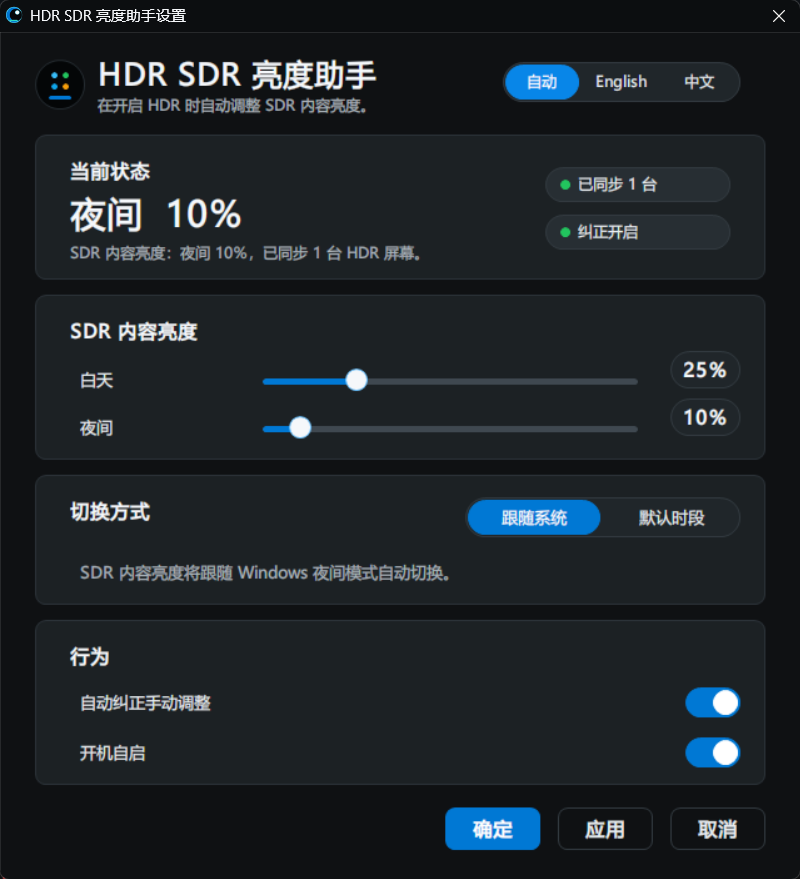

# HDR SDR Brightness

[English](#english) | [中文](#中文)

## English

A minimal Windows tray utility that automatically adjusts **Windows SDR content brightness** while HDR is enabled.

It is useful for OLED, QD-OLED, MiniLED, HDR monitors, HDR TVs, and HDR-capable laptop displays where SDR apps become too bright, too dim, or washed out after enabling Windows HDR.

### Download

Download the latest release from [GitHub Releases](https://github.com/yinjunonly/hdr-sdr-brightness/releases/latest).

Use the `HdrSdrBrightness-1.0.1-win64.zip` package, extract it, and run `HdrSdrBrightness.exe`.

### Use

Run `HdrSdrBrightness.exe`; the settings window opens and the app also stays in the system tray.

Use `HdrSdrBrightness.exe --background` for a quiet tray-only launch. Start with Windows uses this mode.

Tray menu:

- Apply now
- Settings: language, SDR content brightness, fallback schedule, startup
- Start with Windows
- Open Display settings
- Exit

### Default Behavior

- Night SDR content brightness: `10`
- Day SDR content brightness: `25`
- Switching mode: follow Windows Night Light when available, otherwise use the default schedule
- Default schedule: night starts at `18:00`, day starts at `08:00`
- Applies the correct SDR content brightness immediately on startup
- Checks manual SDR brightness changes every 15 seconds and restores the configured value
- Shows a system notification when restoring a manual change
- Applies brightness changes gradually in both directions
- Manual-change restore can be disabled in Settings
- Clicking the restore notification opens a detail dialog

### UI And Icon

- English and Chinese UI with automatic language detection
- Light and dark modes follow the Windows app theme
- Custom-drawn Windows Settings-style surface with cards, switches, sliders, segmented controls, and hover states
- GDI+ antialiasing for rounded controls
- Tray hover shows a compact live summary: mode, target SDR content brightness, HDR display status, and auto-restore state
- Tray icon is optimized for small sizes with a high-contrast abstract mark

### Notes

Configuration is stored under the current user:

```text
HKCU\Software\OledHdrSdrSync
```

Start with Windows uses:

```text
HKCU\Software\Microsoft\Windows\CurrentVersion\Run\HdrSdrBrightness
```

No administrator privileges are required.

### Development Build

End users should download the release package instead of building locally.

Building from source requires MinGW `g++` and `windres`.

```powershell
.\build.ps1
```

The project version is stored in `VERSION`. Release archives are created with:

```powershell
.\package.ps1
```

### License

MIT License. See [LICENSE](LICENSE).

### Discovery Keywords

People often describe this problem in different ways. These keywords are included to make the project easier to find:

```text
Windows HDR SDR brightness
Windows HDR SDR content brightness
Windows SDR content brightness
HDR SDR brightness balance
HDR/SDR brightness balance
SDR content brightness slider
SDR content brightness too bright
SDR content too bright in HDR
SDR content too dark in HDR
Windows HDR too bright
Windows HDR too dim
Windows HDR washed out
Windows 11 HDR washed out
Windows 10 HDR washed out
Auto HDR washed out
HDR desktop too bright
HDR desktop too dim
HDR desktop washed out
HDR colors washed out
HDR looks washed out
OLED HDR brightness
QD-OLED HDR brightness
MiniLED HDR brightness
HDR monitor SDR brightness
HDR TV Windows SDR brightness
Windows Night Light SDR brightness
SDR white level
```

## 中文



一个极简 Windows 托盘工具，用来在开启 HDR 时自动调整 **Windows SDR 内容亮度**。

适用于 OLED、QD-OLED、MiniLED、HDR 显示器、HDR 电视和支持 HDR 的笔记本屏幕，用来缓解开启 Windows HDR 后 SDR 应用过亮、过暗或发灰的问题。

### 下载

请从 [GitHub Releases](https://github.com/yinjunonly/hdr-sdr-brightness/releases/latest) 下载最新版。

下载 `HdrSdrBrightness-1.0.1-win64.zip`，解压后运行 `HdrSdrBrightness.exe`。

### 使用

运行 `HdrSdrBrightness.exe` 会打开设置页，同时程序也会留在系统托盘。

如需安静地只进托盘，可使用 `HdrSdrBrightness.exe --background`；开机自启会使用这个模式。

托盘菜单：

- 立即应用
- 设置：语言、SDR 内容亮度、默认时段、开机自启
- 开机自启
- 打开显示设置
- 退出

### 默认行为

- 夜间 SDR 内容亮度：`10`
- 白天 SDR 内容亮度：`25`
- 切换方式：可用时跟随 Windows 夜间模式，否则使用默认时段
- 默认时段：`18:00` 进入夜间，`08:00` 进入白天
- 启动后立即应用当前时段的 SDR 内容亮度
- 每 15 秒检查一次手动修改，并恢复到配置值
- 恢复手动修改时显示系统通知
- 调高或调低都会平滑渐变
- 可以在设置中关闭“自动纠正手动调整”
- 点击恢复通知会打开详情弹框

### 界面与图标

- 支持中文和英文界面，默认自动跟随系统语言
- 浅色和深色模式跟随 Windows 应用主题
- 设置页使用自绘的 Windows 设置风格界面：卡片、开关、滑杆、分段控件和悬停效果
- 圆角控件使用 GDI+ 抗锯齿绘制
- 托盘悬停会显示当前模式、目标 SDR 内容亮度、HDR 显示器状态和自动纠正状态
- 托盘图标已改为适合小尺寸识别的高对比抽象图形

### 说明

程序使用当前用户注册表保存配置：

```text
HKCU\Software\OledHdrSdrSync
```

开机自启使用：

```text
HKCU\Software\Microsoft\Windows\CurrentVersion\Run\HdrSdrBrightness
```

不需要管理员权限。

### 开发构建

普通用户请优先下载 Release 包，不需要自己构建。

从源码构建需要 Windows 上的 MinGW `g++` 和 `windres`。

```powershell
.\build.ps1
```

项目版本号存放在 `VERSION`。生成 Release 压缩包使用：

```powershell
.\package.ps1
```

### 开源许可

MIT License，详见 [LICENSE](LICENSE)。

### 搜索关键词

很多用户不会直接搜索软件名，而是会用下面这些问题描述搜索，所以 README 保留这些关键词，方便同类用户发现项目：

```text
Windows HDR 自动亮度
Windows HDR SDR 亮度
Windows SDR 内容亮度
Windows SDR 内容亮度滑块
HDR 下 SDR 内容过亮
HDR 下 SDR 内容过暗
HDR 开启后桌面太亮
HDR 开启后桌面太暗
HDR 开启后颜色发灰
HDR 发灰
HDR 洗白
Auto HDR 发灰
OLED HDR 太亮
OLED HDR 太暗
QD-OLED HDR 亮度
MiniLED HDR 太亮
MiniLED HDR 太暗
HDR 显示器 SDR 亮度
HDR 电视 Windows SDR 亮度
Windows 夜间模式 SDR 亮度
SDR White Level
```
